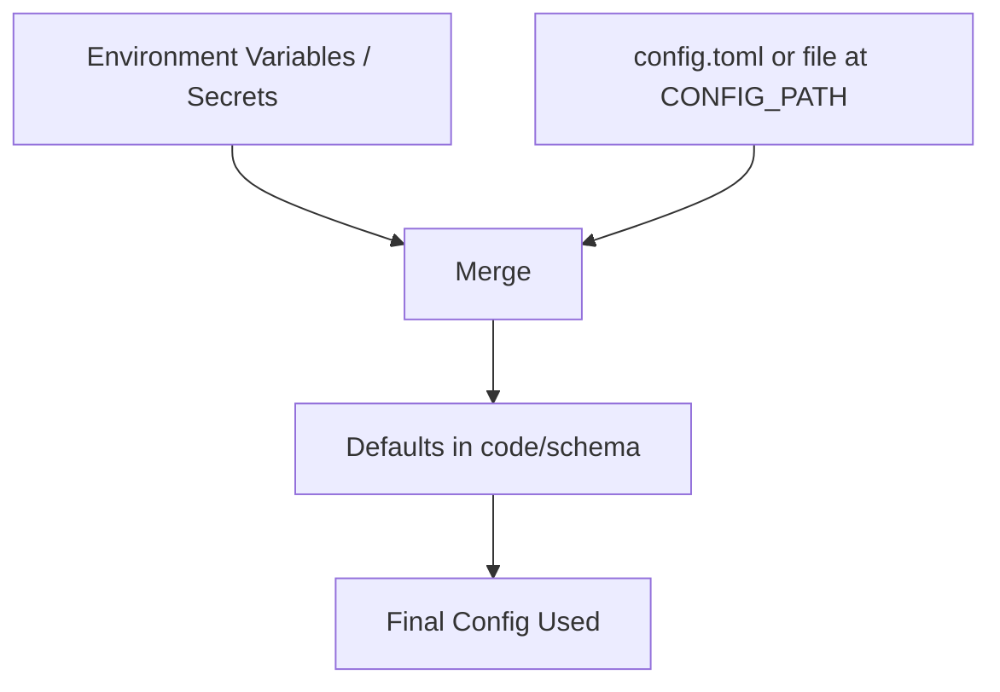

# Configuration Guide

This guide covers all configuration options for the Catalyst TAK Adapter.

## Configuration Files

You must provide a valid configuration file to start the adapter.

The adapter will check if the environment variable `CONFIG_PATH` is set. If it is, it will use that path as the configuration file. If it is not, it will look for `config.toml` in the root of the project.

An example configuration file is provided in the root of the project: `config.example.toml`

### Configuration Loading Hierarchy

The adapter integrates configuration from multiple sources in the following order of precedence (highest to lowest):

1. **Environment Variables** (including secrets, e.g., `FLY_SECRET_*` and/or `process.env`)
2. **config.toml** (or the file specified by `CONFIG_PATH`)
3. **Defaults** (as defined in the code)

- **Environment variables always override values in `config.toml`.**
- If a value is not set in either, the default from the code/schema is used.
- If you use a `.env` file, make sure it is loaded by your process manager or shell (the adapter itself does not auto-load `.env`).
- The `NODE_ENV` flag affects config as follows:
  - If `NODE_ENV` is `development`, the `dev` flag in config is set to `true`.
  - For any other value, `dev` is set to `false` and `tak.raw_key_and_cert` is set to `true` (for production-like environments).

**Config loading flow:**

### Overridable Secret Values (Environment Variables)

The following configuration values can be overridden by environment variables (secrets). If set, these environment variables take precedence over values in `config.toml`:

| Config Section | Config Key       | Environment Variable Name           |
| -------------- | ---------------- | ----------------------------------- |
| tak            | raw_key_and_cert | RAW_KEY_AND_CERT                    |
| tak            | key_file         | FLY_SECRET_TAK_KEY_FILE             |
| tak            | cert_file        | FLY_SECRET_TAK_CERT_FILE            |
| tak            | endpoint         | FLY_SECRET_TAK_ENDPOINT             |
| tak            | connection_id    | FLY_SECRET_TAK_CONNECTION_ID        |
| consumer       | catalyst_token   | FLY_SECRET_CONSUMER_CATALYST_TOKEN  |
| consumer       | catalyst_query   | FLY_SECRET_CONSUMER_CATALYST_QUERY  |
| producer       | catalyst_app_id  | FLY_SECRET_PRODUCER_CATALYST_APP_ID |

- `raw_key_and_cert` (set via `RAW_KEY_AND_CERT`) determines if the TAK key and cert are read as raw strings from environment variables instead of file paths. This is typically used for cloud deployments (e.g., Fly.io secrets).
- These environment variables are typically set as secrets in your deployment environment (e.g., Fly.io, Docker, CI/CD, or your shell).
- If you use a `.env` file, ensure it is loaded by your process manager or shell (the adapter does not auto-load `.env`).
- All other config values must be set in `config.toml` or your chosen config file.

## Configuration Sections

- [TAK Configuration](./tak-config.md)
- [Producer Configuration](./producer-config.md)

## Default Values

**Note:**
Default values only apply when a config file exists

| Key                                      | Default Value                                                 |
| ---------------------------------------- | ------------------------------------------------------------- |
| producer.catalyst_jwks_endpoint          | https://gateway.catalyst.devintelops.io/.well-known/jwks.json |
| producer.graphql_port                    | 8080                                                          |
| producer.graphql_host                    | 0.0.0.0                                                       |
| producer.local_db_path                   | ./db/producer                                                 |
| consumer.catalyst_query_poll_interval_ms | 10000                                                         |
| consumer.catalyst_endpoint               | https://gateway.catalyst.devintelops.io/graphql               |

## Environment Variables

- `CONFIG_PATH` - Override the path to the configuration file

## File Paths and Mounting

When running in Docker, the following paths are used:

- Configuration: `/usr/src/app/config.toml`
- Key: `/usr/src/app/key.pem`
- Certificate: `/usr/src/app/cert.pem`
- Database: `/usr/src/app/db`

## See Also

#### TODO

- [TAK Configuration](./tak-config.md)
- [Producer Configuration](./producer-config.md)
- [Consumer Configuration](./consumer-config.md)
- [Parser Configuration](./parser-config.md)
- This See Also section for links to other sections
